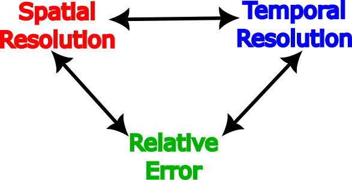

# Basics of Mode Design

This section gives an overview of some of the basic factors to consider when designing radar modes and experiments.  It is also useful to help understand which data files you should use when there are multiple available and how to properly interpret the data

```{admonition} TL;DR
- For F-region studies, use long pulse (LP) data
- For E-region studies, use alternating code (AC) data
- Modes designed for spatial imaging will have lots of beams but longer time resolution
- Most standard modes modes try to balance these factors to achieve reasonable spatial and temporal resolution for both E- and F-region data
```

(integration-period)=
## Integration Period
The integration period is the length of time autocorrelation functions are summed over before fitting to the ISR spectrum to find plasma parameters.  This is determined in post-processing, and often raw data from one experiment is processed with multiple integration periods.  The longer the integration period, the more independent pulses contribute to the spectrum, which because the ISR technique is inherently statistical, results in higher confidence in the fitted parameters.  In short, a longer integration period will usually mean less noisy data with few errors. However, long integration periods will also have lower temporal resolution and may smear out sharp transient features.  In general, you should chose the longest integration period that still captures the time scales of interest for the phenomena you are studying.

## Beam Positions
The number of beams a mode uses and their direction is fixed in a particular mode and therefore must be selected before the experiment is run.  Despite this, there is great flexibility in how beams can be configured for different modes.  In general, a larger number of beams will allow higher horizontal spatial resolution, but because each beam will be revisited less frequently, it will require a longer integration period to collect sufficient independent measurements.  Beams do not need to be evenly spaced across the field-of-view and can be clumped in tight clusters or arranged along specific lines for specialized modes.  "Beam camping" (the process of revisiting one beam more frequently than the others) can also be used to achieve higher temporal resolution in a specific beam while still having a relatively large number of beams.

## Range Resolution
Range resolution is related to how autocorrelation functions are summed along each beam and is set in post-processing, similar to the integration period.

## Types of Pulses
Modes can be electronically configured to use different types of pulses depending on the scientific area of interest.  This aspect of radar engineering is highly sophisticated and there are many texts that discuss it in great detail, but in general AMISR systems use either long pulses (a relatively long transmitted pulse which is sampled and correlated against itself upon receive to resolve range) or coded pulses (a series of phase-modulated pulses that have been cleverly designed to avoid range ambiguity).  Coded pulses can generally achieve higher range resolution, but have lower sensitivity at long ranges.  AMISR usually uses the following configurations to study the different ionospheric layers:

- **F-region:** Long Pulse (LP)
- **E-region:** Alternating Code (AC)
- **D-region:** Barker Code (BC)

It is common to design modes that interleave different types of pulses so that data can be collected that is good in multiple range regimes. Most standard modes will collect both LP and AC data.  BC data are more specialized and although some common modes collect these data, they require more sophisticated processing and are not automatically posted publicly.

## Duty Cycle
The radar duty cycle is fraction of time the radar is transmitting.  In a higher duty cycle, more independent pulses are transmitted and received in a given period of time and error on the processed data should be lower.  However, duty cycle is often constrained by outside factors, such as the economics of powering and running the radar (i.e. fuel and electricity costs), equipment limitations, and environmental factor (to avoid overheating).

## Signal-to-Noise Ratio
In addition to the number of independent pulses collected, the other major factor in data error is the Signal-to-Noise Ratio (SNR).  This is primarily impacted by both the transmit power of the radar, which can fluctuate over the lifetime of the facility depending on its conditions and maintenance state, and the background plasma density in the ionosphere.  Dense plasma will return a stronger signal, which can be used to your advantage during periods where you can expect the background density to be relatively high (i.e., summer daytime).  This means that the radar often has more capabilities in terms of spatial and/or temporal resolution during certain times of the year or particular categories of events. 

## Trade Space

AMISRs are extremely flexible, however they have limitations like all physical instruments.  In general, when designing a mode, you are working in the following trade space:



Spatial Resolution &harr; Number of Beams

Temporal Resolution &harr; Integration Period

Most standard AMISR modes have been designed to balance these factors to collect data that is potentially useful for as many scientific studies as possible.  However, if you have interest in a specific phenomena or type of observation, you are encouraged to contact the PI about potentially designing a specialized mode or campaign. 
