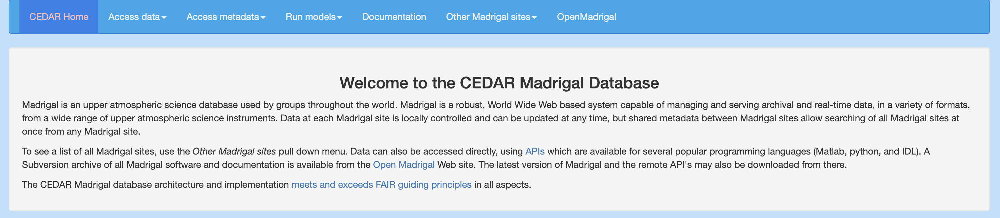
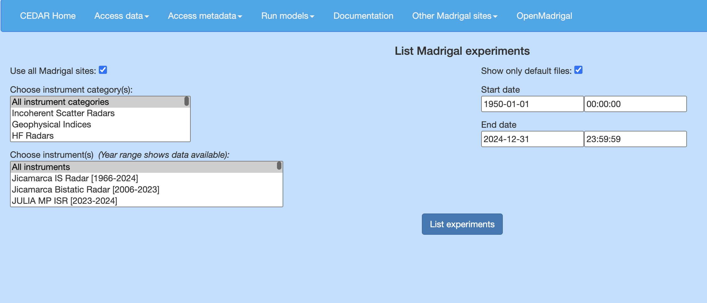
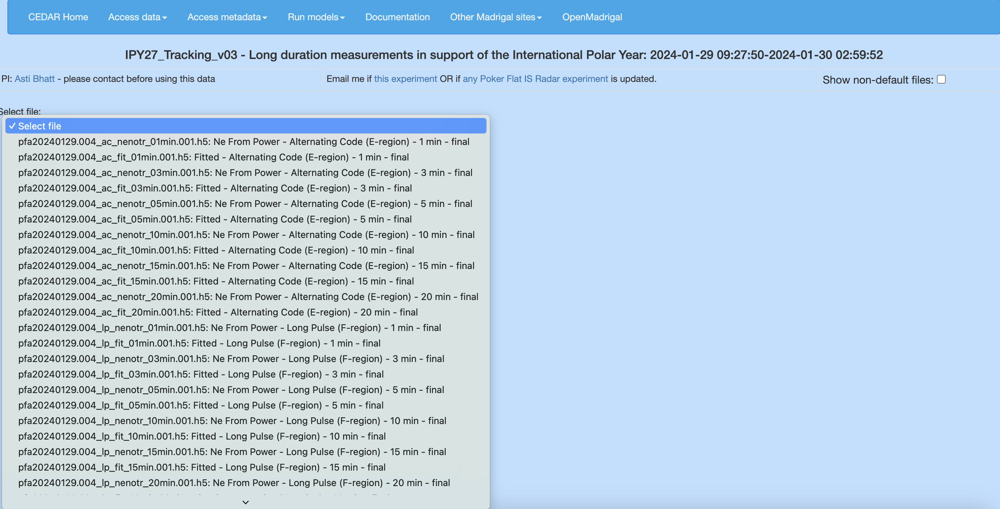
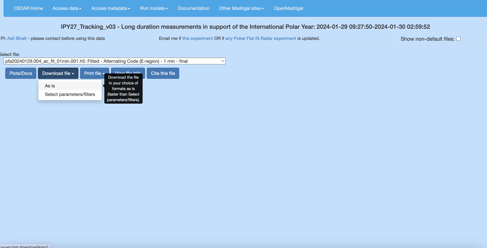

# Madrigal Database

Processed data and other information about the radars is available on the [Madrigal website](http://cedar.openmadrigal.org/index.html).

To access the data for downloading, click [Access data, List experiments, and select instrument category and instrument](http://cedar.openmadrigal.org/list).

## Navigate Database

If you know the date and time you are interested in, the easiest way to navigate to the appropriate data files is to select the instrument category and the instrument. Then, specify the date and timeframe of the experiment. Then, List experiments to view all experiments. 

Select the IPY27_Tracking_v03 experiment and use the drop-down menu to select the specific file to download. 

## Download Data

Once the file is selected, click on "Download file" and then "As is" to download the file.  

