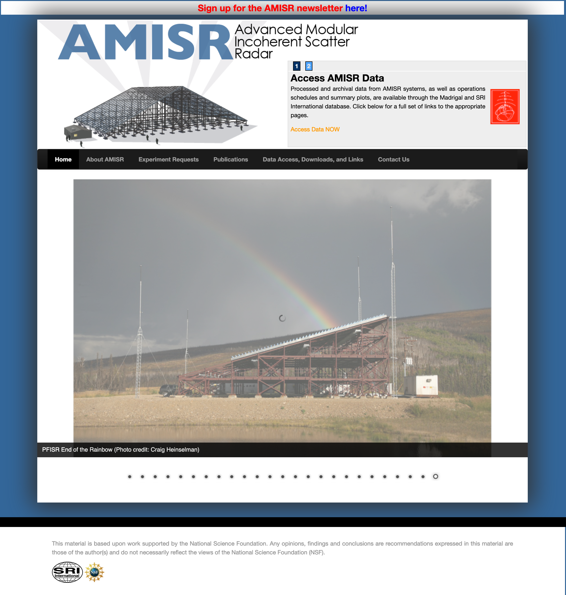
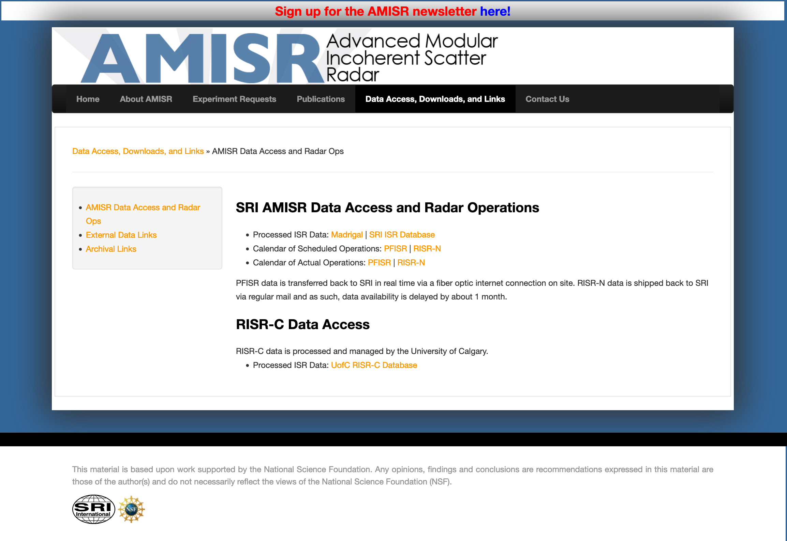
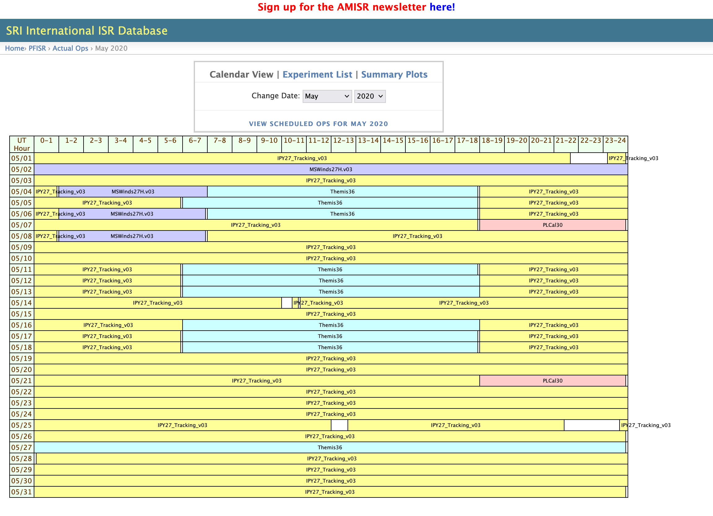
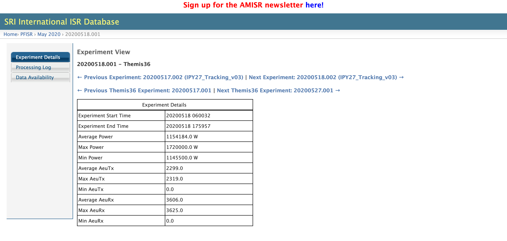
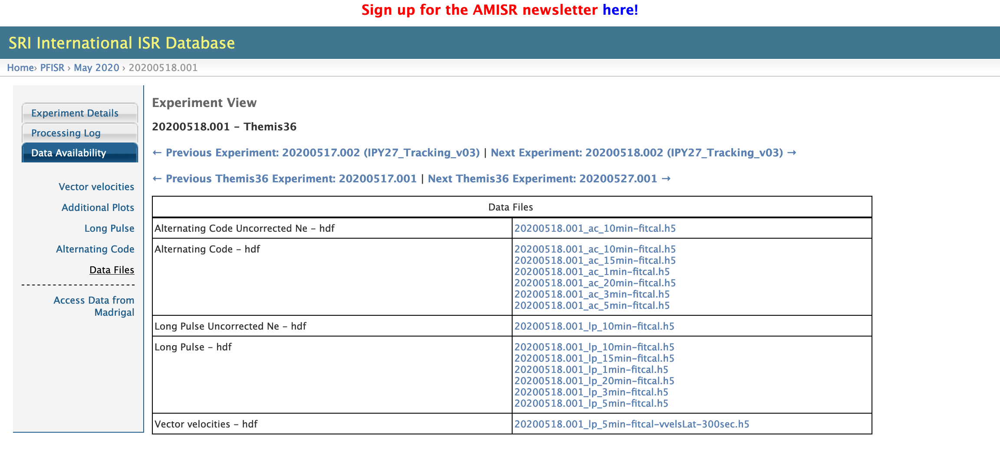
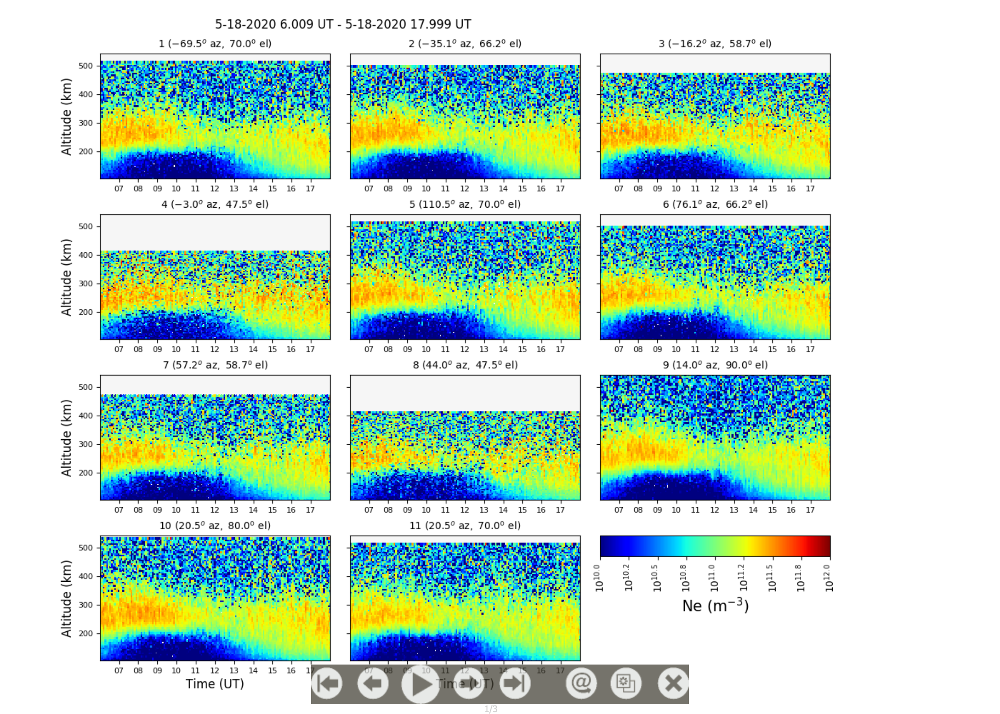

# SRI Database

Processed AMISR data and other information about the radars is available on the [SRI AMISR website](https://amisr.com/amisr/).



To access the data for downloading, click [Data Access, Downloads, and Links](https://amisr.com/amisr/links/data-access/).



## Navigate Database

If you know the date and time you are interested in, the easiest way to navigate to the appropriate datafiles is selecting the appropriate radar from "Calendar of Actual Operations".  To follow along, select "PFISR" here.

```{note}
The SRI AMISR website only hosts processed data from the SRI-operated radars (PFISR and RISR-N).  RISR-C is operated by University of Calgary and those data can be accessed from the [UofC RISR-C database](https://data.phys.ucalgary.ca/sort_by_project/RISR-C/) (link at bottom of page).
```

Use the drop-down menus next to "Change Date" at the top of the page to select your month of interest.  This is the operation calendar for May 2020.  Note that each row is one day of the month, and universal time (UT) stretches horizontally across the calendar.  Each colored block is one AMISR experiment.  The text in each block is the experiment mode.  Hovering over this text reveals the unique experiment number for that particular mode. Note that these are NOT organized by day or hour and can start and end at any time, although there are some patterns as to when certain modes are generally run (i.e., Themis36 is often used as a nighttime mode during moon-down periods).



Select the Themis36 experiment on May 18, 2020.



## Download Data

Now choose "Data Availability" from the left sidebar menu.  This menu will expand with a number of additional options.  To download data files directly, select "Data Files".



This produces a table of data files.  Click on the filename to download.  For processed data, the file naming conventions is as follows:

`{Experiment Number}_{Pulse Code}_{Integration Period}-fitcal.h5`

**Experiment Number:** A unique decimal number that identifies individual experiments.  These are formed as `YYYYMMDD.NNN` where `YYYYMMDD` is the date the experiment STARTS on and `NNN` denotes the number of the experiment in that day.

**Pulse Code:** Either `lp` (long pulse) or `ac` (alternating code).

**Integration Period:** In recent years, all data are processed using multiple integration periods for convenience.  A good rule of thumb is to choose the longest integration period that still gives you the time resolution you need for your particular scientific application (see [Integration Period](integration-period) for more details).

## Summary Plots

To view summary plots for this experiment, select either "Long Pulse" or "Alternating Code" from the left sidebar.  This produces a LARGE table of summary plots to view.  This table contains a row for each major parameter at each integration period.  


This is long, but scroll down to the parameter and integration period of interest (in this example, electron density at 1 minute).  Click on one of the radar square thumbnails in the second column to view the summary plots.



Each subplot in this figure shows a RTI from one beam of the experiment.  To keep plots readable, no more than 24 hours of data are plotted in a subplot and no more than 11 subplots are shown in one figure.  If the length of the experiment or the number of beams dictates more than one page is necessary, these can be flipped through either using the control bar in the bottom of the plot or your keyboard arrow keys.
